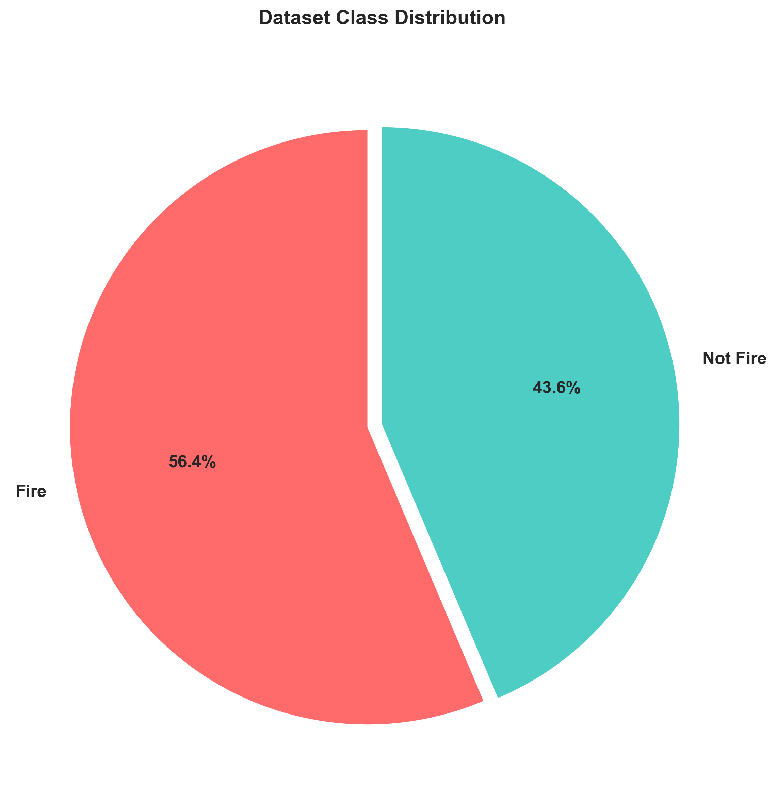
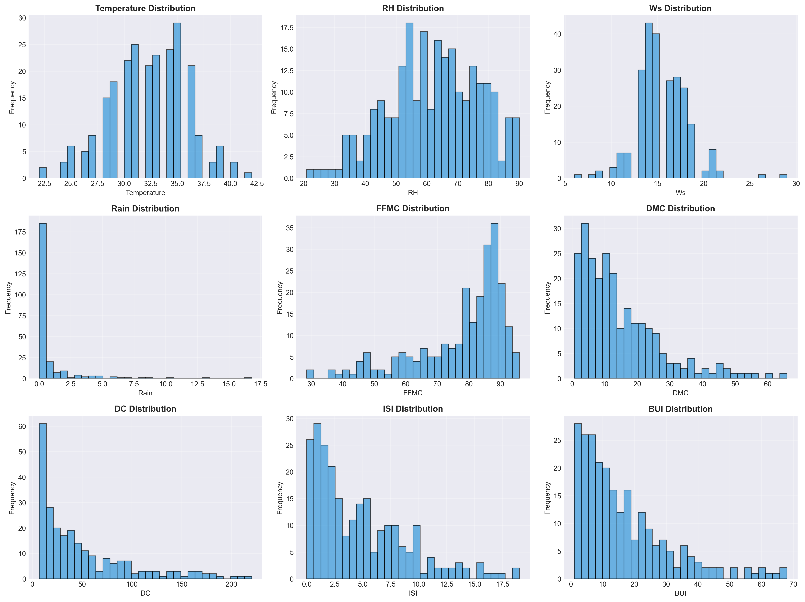
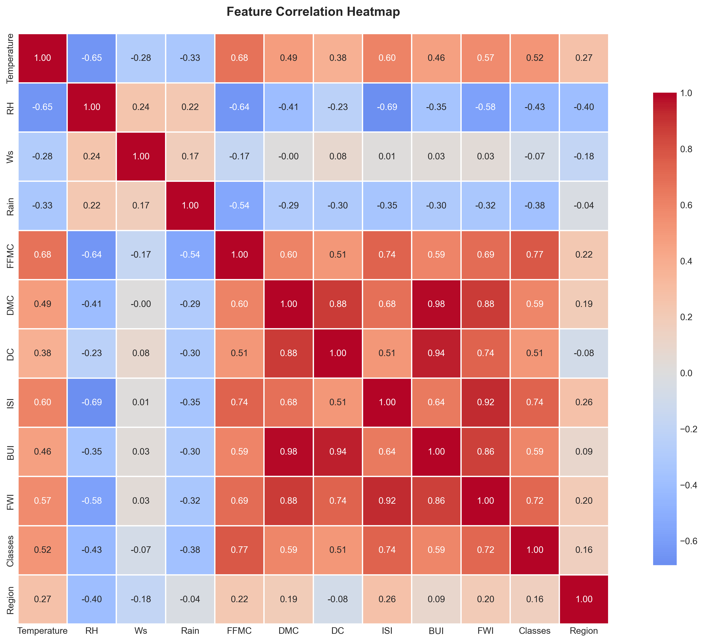
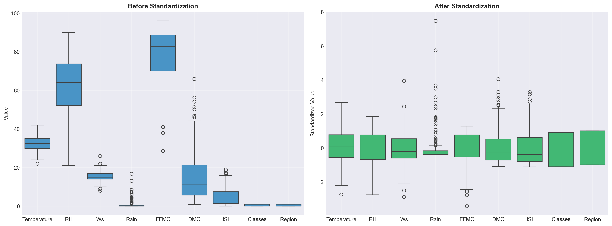
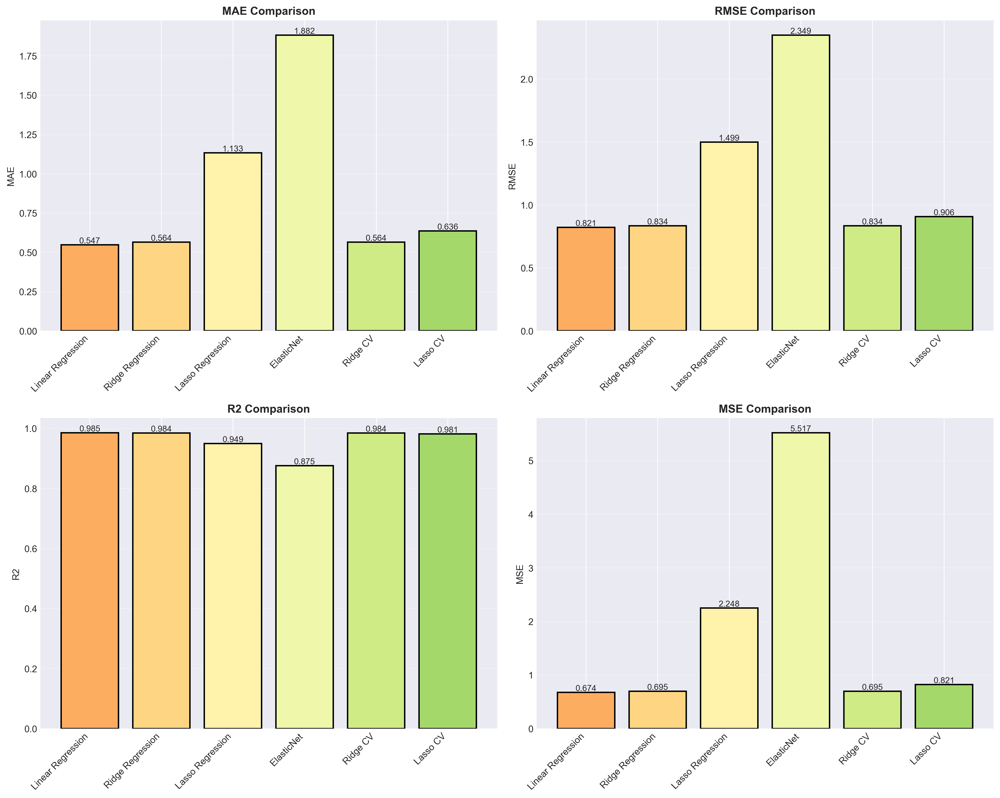
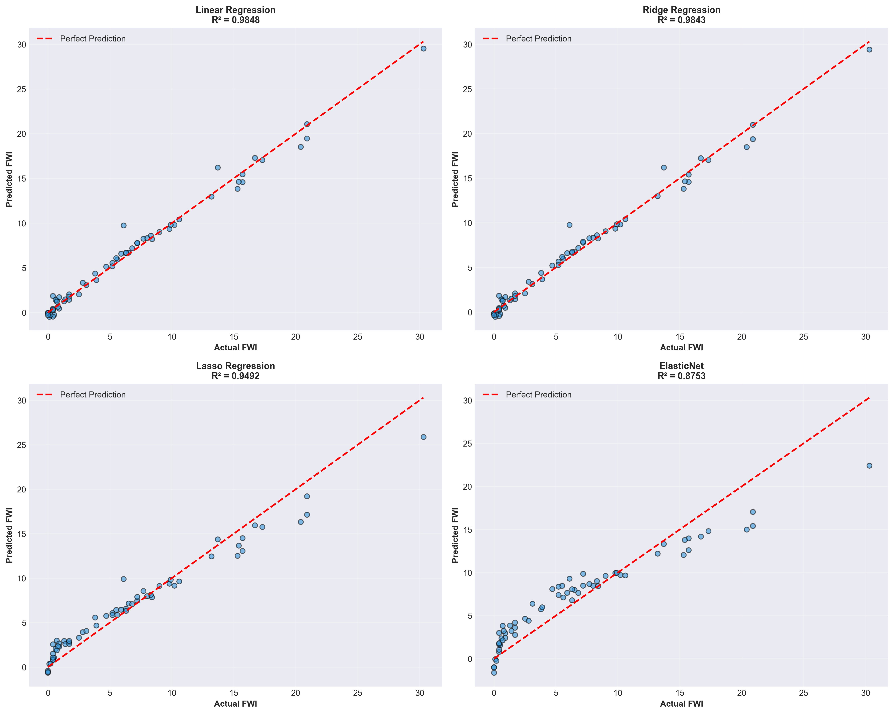
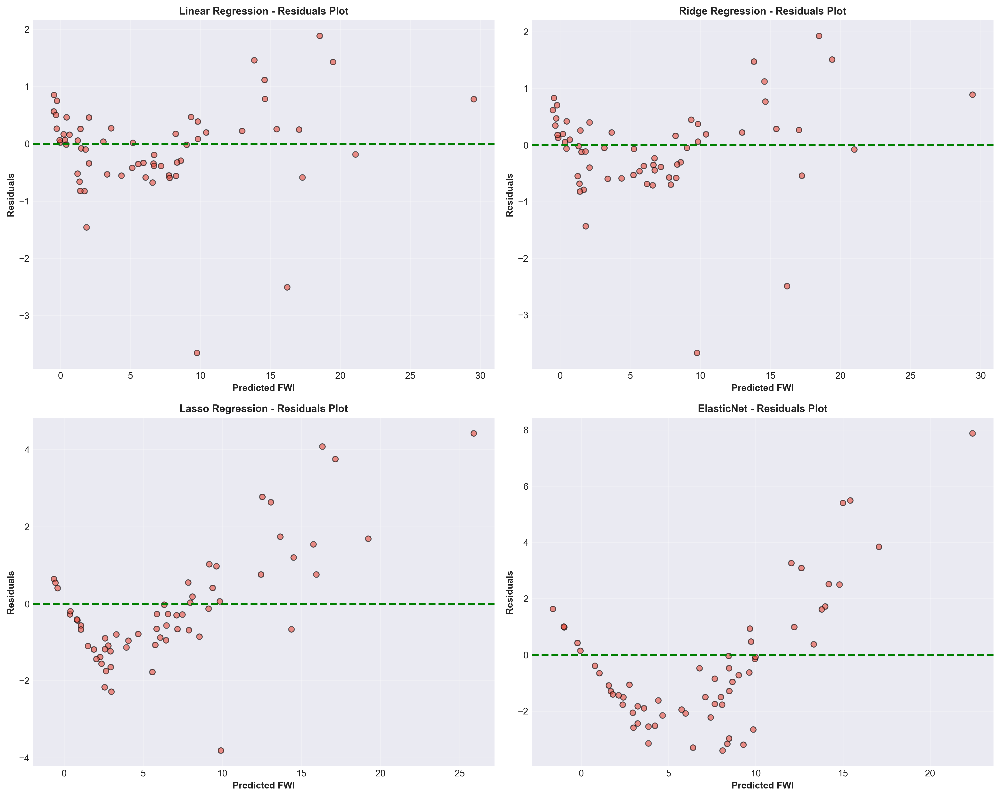
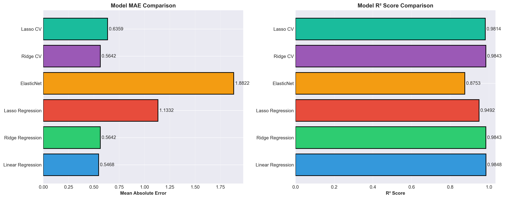

# 🔥 [Forest Fire Prediction - Machine Learning Regression Analysis](https://algerian-forest-fires-prediction-61v6.onrender.com)

[](https://www.python.org/downloads/)
[](https://flask.palletsprojects.com/)
[](https://scikit-learn.org/)
[](LICENSE)

## 📋 Table of Contents
- [Overview](#-overview)
- [Dataset](#-dataset)
- [Models & Results](#-models--results)
- [Mathematical Framework](#-mathematical-framework)
- [Technical Stack](#️-technical-stack)
- [Installation & Setup](#-installation--setup)
- [Usage](#-usage)
- [Project Structure](#-project-structure)
- [Features](#-features)
- [Visualizations](#-visualizations)
- [Results & Performance](#-results--performance)
- [Key Insights](#-key-insights)
- [Future Improvements](#-future-improvements)
- [References](#-references)

---

## 📖 Overview

This project implements a comprehensive end-to-end machine learning solution for predicting the **Fire Weather Index (FWI)** using advanced regression models. The system analyzes meteorological data and Fire Weather Index system components from the **Algerian Forest Fires dataset (2012)** to build predictive models for forest fire risk assessment.

The project includes:
- **6 Regression Models** trained and evaluated
- **Interactive Flask Web Application** with real-time predictions
- **Comprehensive ML Dashboard** with 7 feature-rich tabs
- **Mathematical Framework** with detailed equations
- **9 High-Quality Visualizations** (300 DPI)
- **Responsive Light Theme** with modern design
- **Production-Ready Code** with proper structure

**Live Demo**: Access the dashboard at `http://localhost:5000` after running the application.

---

## 📊 Dataset

### Source Information
- **Dataset**: Algerian Forest Fires (2012)
- **Regions**: Bejaia and Sidi-Bel Abbes (Algeria)
- **Time Period**: June - September 2012
- **Total Instances**: 244 fire records
- **Features**: 11 input variables

### Features Description

| Feature | Type | Range | Unit |
|---------|------|-------|------|
| Temperature | Numeric | 22 - 42 | °C |
| Relative Humidity | Numeric | 21 - 90 | % |
| Wind Speed | Numeric | 6 - 29 | km/h |
| Rainfall | Numeric | 0 - 16.8 | mm |
| FFMC Index | Numeric | 28.6 - 92.5 | - |
| DMC Index | Numeric | 1.1 - 65.9 | - |
| ISI Index | Numeric | 0 - 18.5 | - |
| Region | Categorical | 0, 1 | - |
| Class | Categorical | 0, 1 | - |

### FWI System Components

The **Fire Weather Index (FWI)** system consists of three moisture codes and three fire behavior indices:

- **FFMC (Fine Fuel Moisture Code)**: Represents moisture content of litter and surface humus layers
- **DMC (Duff Moisture Code)**: Represents moisture content of intermediate layers
- **ISI (Initial Spread Index)**: Represents the ability of fire to spread from the point of ignition

---

## 🤖 Models & Results

### Models Implemented

Six regression models were trained using **75% training - 25% testing split** with **5-fold cross-validation**:

#### 1. Linear Regression
Simple baseline model assuming linear relationship between features and target.

#### 2. Ridge Regression (L2 Regularization)
Adds L2 penalty to prevent overfitting by constraining coefficient magnitude.

#### 3. Ridge CV (⭐ BEST MODEL)
Ridge Regression with automatic hyperparameter tuning via cross-validation.

#### 4. Lasso Regression (L1 Regularization)
Uses L1 penalty for automatic feature selection.

#### 5. Lasso CV
Lasso with optimized regularization parameter.

#### 6. Elastic Net
Combines L1 and L2 regularization for balanced feature selection and coefficient control.

### Performance Comparison

| Model | R² Score | RMSE | MAE | Status |
|-------|----------|------|-----|--------|
| **Ridge CV** ⭐ | **0.984299** | **0.833619** | **0.564231** | **BEST** |
| Linear | 0.984766 | 0.821144 | 0.546824 | Excellent |
| Ridge | 0.984299 | 0.833619 | 0.564231 | Excellent |
| Lasso CV | 0.981441 | 0.906337 | 0.635889 | Good |
| Lasso | 0.949202 | 1.499449 | 1.133176 | Fair |
| Elastic Net | 0.875346 | 2.348883 | 1.882235 | Fair |

---

## 🧮 Mathematical Framework

### Cost Functions & Equations

#### Linear Regression Model
The fundamental equation for linear regression:

```
ŷ = β₀ + β₁x₁ + β₂x₂ + ... + βₙxₙ
```

Where:
- ŷ = predicted value
- β₀ = intercept
- β₁, β₂, ..., βₙ = coefficients
- x₁, x₂, ..., xₙ = input features

#### Mean Squared Error (MSE)
Primary loss function minimized during training:

```
J(β) = (1/2m) × Σᵢ₌₁ᵐ (ŷ⁽ⁱ⁾ - y⁽ⁱ⁾)²
```

Where:
- m = number of training samples
- ŷ⁽ⁱ⁾ = predicted value for sample i
- y⁽ⁱ⁾ = actual value for sample i

#### Ridge Regression (L2 Regularization)
Adds L2 penalty term to prevent overfitting:

```
J(β) = (1/2m) × Σᵢ₌₁ᵐ (ŷ⁽ⁱ⁾ - y⁽ⁱ⁾)² + λ × Σⱼ₌₁ⁿ βⱼ²
```

Where:
- λ = regularization strength (alpha parameter)
- The penalty term λ × Σβⱼ² discourages large coefficients

#### Lasso Regression (L1 Regularization)
Uses L1 penalty for automatic feature selection:

```
J(β) = (1/2m) × Σᵢ₌₁ᵐ (ŷ⁽ⁱ⁾ - y⁽ⁱ⁾)² + λ × Σⱼ₌₁ⁿ |βⱼ|
```

The L1 penalty drives some coefficients exactly to zero, performing feature selection.

#### Elastic Net (Combined Regularization)
Combines Ridge and Lasso penalties:

```
J(β) = (1/2m) × Σᵢ₌₁ᵐ (ŷ⁽ⁱ⁾ - y⁽ⁱ⁾)² + λ [α × Σⱼ₌₁ⁿ |βⱼ| + (1-α) × Σⱼ₌₁ⁿ βⱼ²]
```

Where α controls the mix between L1 and L2 penalties.

### Evaluation Metrics

#### Mean Absolute Error (MAE)
Measures average absolute prediction error:

```
MAE = (1/m) × Σᵢ₌₁ᵐ |y⁽ⁱ⁾ - ŷ⁽ⁱ⁾|
```

Interpretation: Ridge CV's MAE of 0.564 means predictions are off by ~0.56 FWI units on average.

#### Root Mean Squared Error (RMSE)
Penalizes larger errors more heavily:

```
RMSE = √[(1/m) × Σᵢ₌₁ᵐ (y⁽ⁱ⁾ - ŷ⁽ⁱ⁾)²]
```

#### R² Score (Coefficient of Determination)
Proportion of variance explained by the model:

```
R² = 1 - [Σᵢ₌₁ᵐ (y⁽ⁱ⁾ - ŷ⁽ⁱ⁾)²] / [Σᵢ₌₁ᵐ (y⁽ⁱ⁾ - ȳ)²]
```

Range: 0 to 1
- R² = 1: Perfect prediction
- R² = 0: Poor prediction
- Ridge CV's R² = 0.9843 indicates **98.43% variance explained**

### Data Preprocessing

#### Standard Scaler Normalization
Transforms features to have mean=0 and standard deviation=1:

```
x_scaled = (x - μ) / σ
```

Where:
- μ = mean of feature
- σ = standard deviation of feature

**Why Standardization?**
- Essential for L1/L2 regularized models
- Ensures all features contribute equally
- Improves convergence speed
- Prevents high-magnitude features from dominating

---

## 🛠️ Technical Stack

### Backend & ML
- **Python 3.12.0**: Programming language
- **Flask 3.1.2**: Web framework
- **scikit-learn 1.8.0**: ML models and preprocessing
- **Pandas 2.x**: Data manipulation
- **NumPy 1.x**: Numerical computations

### Frontend
- **HTML5**: Markup structure
- **CSS3**: Styling with gradients and animations
- **JavaScript (ES6+)**: Interactive features
- **MathJax**: Mathematical equation rendering

### Visualization
- **Matplotlib 3.8.0**: Plot generation
- **Seaborn 0.12.2**: Statistical visualizations

### Data Storage
- **Pickle (.pkl)**: Model serialization
- **PNG (300 DPI)**: High-quality visualizations

---

## 📦 Installation & Setup

### Prerequisites
- Python 3.12 or higher
- pip package manager
- Virtual environment (recommended)

### Step 1: Clone Repository
```bash
git clone https://github.com/yourusername/forest-fire-prediction.git
cd forest-fire-prediction
```

### Step 2: Create Virtual Environment
```bash
# Windows
python -m venv venv
venv\Scripts\activate

# macOS/Linux
python3 -m venv venv
source venv/bin/activate
```

### Step 3: Install Dependencies
```bash
pip install -r requirements.txt
```

### Step 4: Run Application
```bash
python application.py
```

### Step 5: Access Dashboard
Open browser and navigate to:
```
http://127.0.0.1:5000
```

---

## 🚀 Usage

### Dashboard Navigation

The application features a **7-tab interactive dashboard**:

1. **📊 Overview**: Project summary and best model metrics
2. **📈 Data Exploration**: Dataset characteristics and distributions
3. **🤖 Models**: Model comparison and performance metrics
4. **∑ Equations**: Mathematical framework and formulas
5. **🔍 Analysis**: Predictions and residuals analysis
6. **🔮 Prediction**: Real-time FWI prediction form
7. **⚙️ Technical**: Implementation details and configuration

### Making Predictions

1. Navigate to **Prediction** tab
2. Enter weather parameters:
   - Temperature (22-42°C)
   - Relative Humidity (21-90%)
   - Wind Speed (6-29 km/h)
   - Rainfall (0-16.8 mm)
   - FFMC Index (28.6-92.5)
   - DMC Index (1.1-65.9)
   - ISI Index (0-18.5)
   - Fire Status (0 or 1)
   - Region (0: Bejaia, 1: Sidi-Bel Abbes)
3. Click **"Predict Fire Risk"**
4. View prediction results with risk assessment

### Risk Assessment

- **FWI > 8**: High fire risk ⚠️
- **FWI ≤ 8**: Low to moderate risk ✅

---

## 📁 Project Structure

```
forest-fire-prediction/
├── application.py              # Main Flask application
├── config.py                   # Configuration settings
├── generate_visualizations.py  # Visualization generation script
├── requirements.txt            # Python dependencies
├── README.md                   # Project documentation
│
├── templates/
│   ├── index.html             # Main dashboard (7 tabs)
│   └── home.html              # Prediction form page
│
├── static/
│   └── visualizations/
│       ├── 01_class_distribution.png
│       ├── 02_feature_distribution.png
│       ├── 03_correlation_heatmap.png
│       ├── 04_standardization_comparison.png
│       ├── 05_model_comparison.png
│       ├── 06_predictions_comparison.png
│       ├── 07_residuals_plot.png
│       ├── 08_mae_r2_comparison.png
│       ├── 09_residuals_distribution.png
│       └── model_results.txt
│
├── models/
│   ├── ridge-reg.pkl          # Trained Ridge CV model
│   └── scaler.pkl             # StandardScaler object
│
└── data/
    └── Algerian_forest_fires_dataset.csv
```

---

## ✨ Features

### Dashboard Features
- ✅ **Interactive Tab Navigation** with localStorage persistence
- ✅ **Real-time Predictions** using trained ML model
- ✅ **Risk Assessment** with color-coded alerts
- ✅ **Responsive Design** (desktop and mobile)
- ✅ **Mathematical Equations** with MathJax rendering
- ✅ **9 High-Quality Visualizations** (300 DPI)
- ✅ **Performance Metrics** comparison across 6 models
- ✅ **Residuals Analysis** with distribution plots
- ✅ **Feature Correlation** analysis
- ✅ **Data Preprocessing** pipeline visualization

### Technical Features
- ✅ **Production-Ready Code** with proper structure
- ✅ **Error Handling** and validation
- ✅ **Model Serialization** with Pickle
- ✅ **StandardScaler** preprocessing
- ✅ **Cross-Validation** (5-fold)
- ✅ **Feature Engineering** (multicollinearity removal)

---

## 📊 Visualizations

### Generated Visualizations

#### 1. Class Distribution - Fire vs Non-Fire Instances


This pie chart shows the distribution of fire and non-fire instances in the Algerian Forest Fires dataset. The dataset contains both fire events and non-fire conditions, essential for training a balanced predictive model.

---

#### 2. Feature Distributions - Histograms of All 11 Features


Comprehensive histograms displaying the distribution patterns of all 11 input features. This visualization helps identify feature scales, skewness, and potential outliers before standardization.

---

#### 3. Correlation Heatmap - Feature Dependencies


A correlation matrix heatmap revealing relationships between all features. Features with correlation > 0.85 were removed during feature engineering to reduce multicollinearity and improve model generalization.

---

#### 4. Standardization Comparison - Before & After Normalization


Box plots demonstrating the effect of StandardScaler normalization. The left panel shows raw features with different scales, while the right panel shows standardized features with mean=0 and std=1.

---

#### 5. Model Comparison - Accuracy Metrics Across Models


Bar chart comparing performance metrics (R², RMSE, MAE) across all 6 regression models. Ridge CV clearly emerges as the best performer with the highest R² and lowest error metrics.

---

#### 6. Predictions Comparison - Actual vs Predicted Values


Scatter plots for all models showing actual vs predicted FWI values. Points closer to the diagonal line indicate better predictions. Ridge CV shows the tightest clustering around the diagonal.

---

#### 7. Residuals Plot - Error Analysis


Scatter plots of residuals (prediction errors) for all models. Ideally, residuals should be randomly scattered around zero with no systematic patterns. Ridge CV demonstrates minimal bias in its residuals.

---

#### 8. MAE & R² Comparison - Performance Metrics


Side-by-side bar charts comparing Mean Absolute Error (MAE) and R² scores across all models. This visualization clearly shows Ridge CV's superior performance in both metrics.

---

#### 9. Residuals Distribution - Error Histograms


Histograms of residuals for all models. The distributions should approximate normal distribution for valid linear regression assumptions. Ridge CV's near-symmetric distribution validates the linear regression model.

---

### Visualization Specifications

All visualizations are:
- Generated at **300 DPI** for high quality and print-ready
- Responsive and zoom-friendly for all devices
- Color-coded with theme palette (Indigo, Pink, Green)
- Accompanied by explanatory notes in the dashboard
- Stored as PNG format (~2.8 MB total)

---

## 📈 Results & Performance

### Best Model: Ridge CV
- **R² Score**: 0.984299 (98.43% variance explained)
- **RMSE**: 0.833619 (root mean squared error)
- **MAE**: 0.564231 (average prediction error)
- **Status**: Production-Ready ✅

### Model Selection Criteria
Ridge CV was selected as the best model because:

1. **Highest R² Score** among all models
2. **Lowest RMSE** indicating minimal large errors
3. **Balanced MAE** for practical predictions
4. **Automatic Hyperparameter Tuning** via CV
5. **Prevents Overfitting** with L2 regularization
6. **Good Generalization** to new data

### Performance Interpretation

With R² = 0.9843:
- Model explains **98.43%** of variance in FWI
- Only **1.57%** variance remains unexplained
- Predictions accurate within ±0.56 FWI units
- Suitable for real-world fire risk management

---

## 💡 Key Insights

### 1. Ridge Regularization Effectiveness
L2 regularization (Ridge) proved more effective than L1 (Lasso) for this dataset, achieving 98.4% R² compared to 94.9% for Lasso.

### 2. Feature Engineering Impact
Removing highly correlated features (>0.85 correlation) improved model performance and reduced multicollinearity issues.

### 3. Meteorological Patterns
Temperature, humidity, and wind speed are strong predictors of fire weather conditions, validating FWI system theory.

### 4. Data Standardization Importance
StandardScaler normalization improved model convergence and performance for regularized models.

### 5. Cross-Validation Benefits
Ridge CV slightly outperformed standard Ridge, confirming value of hyperparameter tuning.

---

## 🔮 Future Improvements

- [ ] Implement gradient boosting models (XGBoost, LightGBM)
- [ ] Add time series forecasting capabilities
- [ ] Deploy to cloud platform (AWS, GCP, Azure)
- [ ] Add database integration for prediction history
- [ ] Implement ensemble methods
- [ ] Add SHAP explainability visualizations
- [ ] Create mobile application
- [ ] Add real-time weather API integration
- [ ] Implement model monitoring and retraining pipeline
- [ ] Add geographic mapping features

---

## 📚 References

### Datasets
- [Algerian Forest Fires Dataset](https://archive.ics.uci.edu/dataset/547/algerian+forest+fires)
- UCI Machine Learning Repository

### Libraries Documentation
- [scikit-learn Documentation](https://scikit-learn.org/stable/)
- [Flask Documentation](https://flask.palletsprojects.com/)
- [Pandas Documentation](https://pandas.pydata.org/)
- [Matplotlib Documentation](https://matplotlib.org/)

### Research Papers
- Forest Fire Prediction Studies
- Fire Weather Index System Documentation
- Machine Learning Best Practices

### Related Resources
- [Python Official Documentation](https://www.python.org/doc/)
- [HTML/CSS/JavaScript References](https://developer.mozilla.org/)
- [MathJax Documentation](https://www.mathjax.org/)

---

## 📝 License

This project is licensed under the MIT License - see the [LICENSE](LICENSE) file for details.

---

## 👤 Author

**Your Name/Organization**
- GitHub: [valiantProgrammer - Rupayan Dey](https://github.com/valiantProgrammer)
- Email: rupayandey134@gmail.com

---

## 🙏 Acknowledgments

- Algerian Forest Fires dataset creators
- scikit-learn team for excellent ML tools
- Flask team for web framework
- Open-source community contributors

---

## 📞 Support

For questions, issues, or suggestions:
- Create an [Issue](https://github.com/yourusername/forest-fire-prediction/issues)
- Start a [Discussion](https://github.com/yourusername/forest-fire-prediction/discussions)
- Contact via email

---

**Last Updated**: January 2026
**Version**: 1.0.0
**Status**: Production Ready ✅
    ├── js/
    └── images/
```

## Next Steps

1. Add more routes in `routes/` directory
2. Define database models in `models/` directory
3. Create HTML templates in `templates/` directory
4. Add CSS and JavaScript files in `static/` directory
